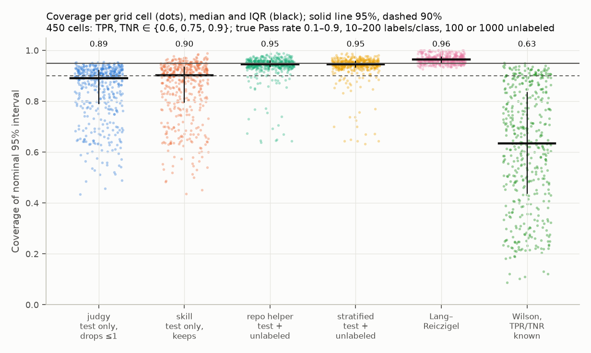
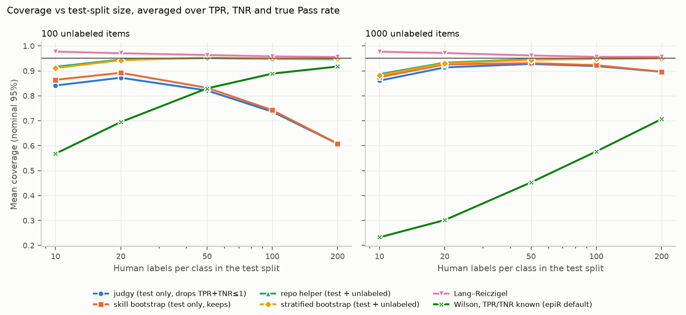
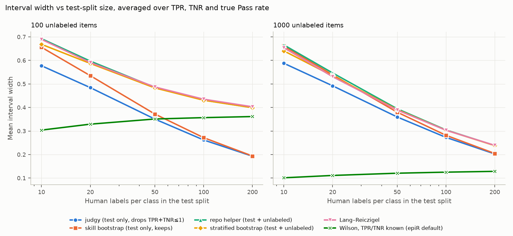
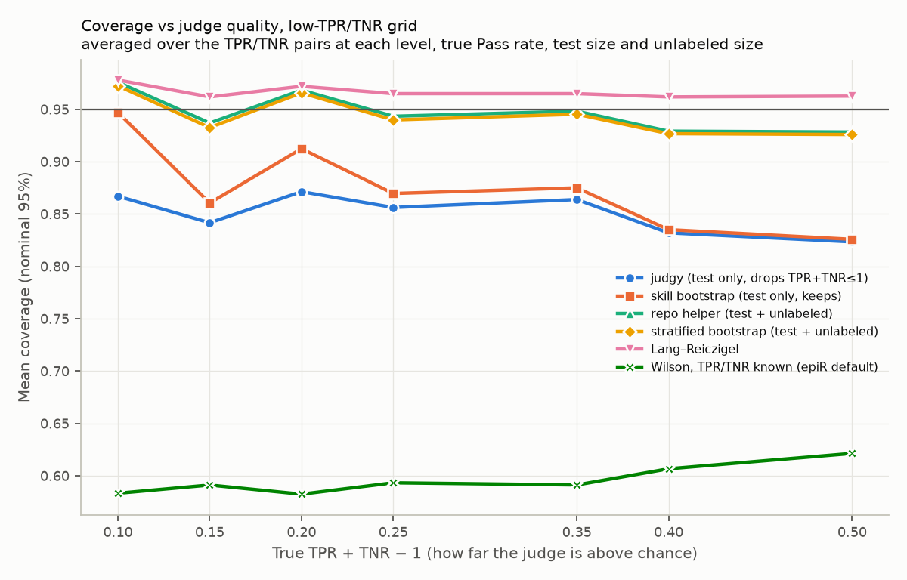

# Intervals for Judge-Corrected Failure Rates

*Methods note for the HW5 prevalence step · simulation study · September 2026*

HW5's optional last step runs the frozen judge over unlabeled traces and
corrects its raw failure rate for the judge's known errors. This note asks what
the 95% interval around that corrected rate has to include to be trustworthy,
compares the interval constructions in use, and tests them in a simulation of
1,400 settings with 500 data sets each.

## Bottom line

- **The corrected rate has three sources of sampling error,** not two: the
  judge's TPR (from the test split's human Passes), its TNR (from the human
  Fails), and its raw rate on the unlabeled traces. For the HW5 judge below, the
  unlabeled sample contributes about 30% of the variance.
- **The interval must resample the unlabeled predictions.** The course helper
  `corrected_prevalence` does this, and its intervals cover about 95%. judgy's
  `estimate_success_rate` and the validate-evaluator skill's `bootstrap_ci`
  resample only the test split. At HW5 sizes they cover about 87%, and they get
  worse as the test split grows.
- **For HW5-sized test splits, Lang–Reiczigel is the most reliable.** It covers
  about 0.97 in every setting, including judges near chance. The default
  interval that treats TPR and TNR as known covers about 0.6 and should not be
  used.

## The HW5 prevalence step

After the judge is frozen and scored once on the test split, HW5's extension
runs it over traces with no human label and estimates how often the failure
occurs. The course helper is `corrected_prevalence` in
`analysis/helpers/reporting.py`. It reads the frozen judge's test TPR and TNR,
takes its predictions on the unlabeled traces, and reports the corrected
failure rate with a bootstrap interval.

A worked case from this project: the frozen `narrates_or_overexplains` judge
had test TPR 21/23 = 0.913 and TNR 12/17 = 0.706, and judged 54 of 167
unlabeled traces Fail (raw failure rate 0.323). Its corrected failure rate is
0.382. The rest of this note uses Pass as the positive class (the HW5
convention), so the estimate is the true Pass rate θ, and the failure rate is
1 − θ.

## Where the error comes from

The Rogan–Gladen correction turns the judge's raw Pass rate p̂ on the
unlabeled traces into an estimate of the true Pass rate:

```
θ̂ = (p̂ + TNR̂ − 1) / (TPR̂ + TNR̂ − 1),   clipped to [0, 1]
```

TPR̂ comes from n_Pass human Passes, TNR̂ from n_Fail human Fails, and p̂ from
n unlabeled traces. Each is a sample proportion. By the delta method, the
variance of θ̂ is approximately

```
Var(θ̂) ≈ [  p(1−p)/n                   ← unlabeled traces
          + θ² · TPR(1−TPR)/n_Pass      ← human Passes
          + (1−θ)² · TNR(1−TNR)/n_Fail  ← human Fails
          ] / (TPR + TNR − 1)²
```

The denominator amplifies all three terms when the judge is weak. For the HW5
judge above:

| Source | Share of Var(θ̂) |
|---|---:|
| Unlabeled traces (n = 167) | 30% |
| Human Passes (n_Pass = 23) | 30% |
| Human Fails (n_Fail = 17) | 40% |

The standard deviation from all three is 0.107. From the test split alone it is
0.090. A "95%" interval built from the test split alone spans ±1.64 true
standard deviations, which covers about 90%.

## Interval constructions

All six constructions share the point estimate above; they differ in which
errors the interval carries.

### Known accuracy (Wilson, the default in epiR)

Treat TPR̂ and TNR̂ as exact. Build a Wilson interval [L, U] for the raw Pass
rate, then push its endpoints through the correction:

```
center = (p̂ + z²/(2n)) / (1 + z²/n)
half   = z/(1 + z²/n) · √( p̂(1−p̂)/n + z²/(4n²) )
L, U   = center − half, center + half

CI(θ)  = [ (L + TNR̂ − 1)/(TPR̂ + TNR̂ − 1),  (U + TNR̂ − 1)/(TPR̂ + TNR̂ − 1) ]
```

with z = 1.96. This carries only the unlabeled term, which is 30% of the
variance in the HW5 example.

### Bootstrap intervals

Every bootstrap here follows the same recipe. For b = 1, …, B, draw new values
TPR\*, TNR\* and p\*, recompute the correction, and take percentiles:

```
θ*_b = clip( (p*_b + TNR*_b − 1) / (TPR*_b + TNR*_b − 1), 0, 1 )
CI   = [ 2.5th percentile, 97.5th percentile ] of θ*_1, …, θ*_B
```

The schemes differ only in how the draws are made:

| Scheme | Used by | TPR\*, TNR\* | p\* |
|---|---|---|---|
| Test only | judgy `estimate_success_rate`; skill `bootstrap_ci` | Resample the n_Pass + n_Fail test pairs together, with replacement | Fixed at p̂ |
| Pooled, with unlabeled | Course helper `corrected_prevalence` | Resample the test pairs together | x\* ~ Binomial(n, p̂), i.e. resample the n unlabeled predictions |
| Stratified, with unlabeled | Simulation only | TP\* ~ Binomial(n_Pass, TPR̂), TN\* ~ Binomial(n_Fail, TNR̂) | x\* ~ Binomial(n, p̂) |

The test-only schemes hold p̂ fixed, so the unlabeled term never enters the
interval. judgy and the skill also differ in one detail: when a resample has
TPR\* + TNR\* ≤ 1, judgy drops it and the skill keeps it (the correction then
flips sign and is clipped). That only matters for judges near chance.

### The stratified bootstrap

A pooled bootstrap draws n_Pass + n_Fail pairs from the whole test split, so
each resample's mix of Passes and Fails varies. With HW5's 23 Passes and 17
Fails, one resample might hold 18 Passes and the next 28. TPR\* is then
estimated from a random, sometimes small, number of Passes, and a resample can
even lack a class entirely.

The stratified bootstrap resamples within each class instead: 23 draws from
the 23 Pass pairs and 17 from the 17 Fail pairs, every time. That matches how
the test split was built, since HW5's `split_labels` stratifies by label. For yes/no outcomes, resampling a class with replacement is the same as
drawing its hit count from a binomial, which is why the table writes it as
TP\* ~ Binomial(n_Pass, TPR̂). The unlabeled predictions are resampled as well.

In the simulation, which used equal class sizes of 10 to 200, stratified and
pooled resampling gave the same coverage. Stratification should matter more
for lopsided or very small splits, where pooled resamples can be left with
only a handful of one class.

### Lang–Reiczigel (2014)

A closed-form interval that carries all three terms. It first nudges each
proportion toward ½, in the style of Agresti–Coull, then applies the
delta-method variance and a shift that corrects the skew from dividing by an
estimated TPR + TNR − 1:

```
TPR′ = (TP + 1)/(n_Pass + 2)            TNR′ = (TN + 1)/(n_Fail + 2)
p′   = (x + z²/2)/(n + z²)
θ′   = (p′ + TNR′ − 1)/(TPR′ + TNR′ − 1)

Var′ = [ p′(1−p′)/(n + z²)
       + θ′² · TPR′(1−TPR′)/(n_Pass + 2)
       + (1−θ′)² · TNR′(1−TNR′)/(n_Fail + 2) ] / (TPR′ + TNR′ − 1)²

Δ    = 2z² · [ θ′ · TPR′(1−TPR′)/(n_Pass + 2) − (1−θ′) · TNR′(1−TNR′)/(n_Fail + 2) ]

CI   = θ′ + Δ ± z·√Var′,   clipped to [0, 1]
```

TP and TN are the judge's hits on the human Passes and Fails, and x is its Pass
count on the unlabeled traces. The three variance terms are the same three
sources as in the delta method above. Compared with the Wilson known-accuracy
interval, it adds the two test-split terms and the shift Δ. R implements it as
`asht::prevSeSp`.

## Applied to the HW5 judge

Intervals for the corrected **failure** rate of the frozen
`narrates_or_overexplains` judge (point estimate 0.382):

| Construction | Error sources | 95% interval | Width |
|---|---|---|---:|
| Known accuracy (Wilson) | Unlabeled only | 0.275 – 0.502 | 0.23 |
| Test-only bootstrap (judgy, skill) | Test split only | 0.200 – 0.621 | 0.42 |
| Pooled bootstrap with unlabeled (course helper) | All three | 0.171 – 0.662 | 0.49 |
| Stratified bootstrap with unlabeled | All three | 0.169 – 0.656 | 0.49 |
| Lang–Reiczigel | All three | 0.146 – 0.612 | 0.47 |

Bootstraps use 20,000 resamples. The course helper's own run on this judge
reported 0.16 – 0.66. With only 40 labeled test traces and 167 unlabeled ones,
the honest answer is wide: the failure rate is somewhere between about 15% and
65%.

## Simulation

### Design

The design follows Flor et al. (2020). Each simulated data set is three
independent binomial samples, matching the three error sources: the judge's
hits on the human Passes, its hits on the human Fails, and its Pass calls on
the unlabeled traces. Each construction builds a 95% interval, and coverage is
the share of 500 data sets per setting whose interval contains the true Pass
rate (Monte Carlo error about ±1 point per setting).

| Factor | Values |
|---|---|
| True Pass rate | 0.1, 0.3, 0.5, 0.7, 0.9 |
| Human labels per class in the test split | 10, 20, 50, 100, 200 |
| Unlabeled traces | 100, 1,000 |
| Main grid (450 settings) | TPR, TNR ∈ {0.6, 0.75, 0.9} |
| Low grid (950 settings) | 19 TPR/TNR pairs from {0.2, …, 0.95} with one value below 0.6 and TPR + TNR ≥ 1.1 |

As in Flor et al., data sets whose observed TPR + TNR ≤ 1 are excluded, because
no correction is possible from them (judgy refuses them). That is 1.4% of data
sets on the main grid and 7.6% on the low grid.

The implementations were checked against the originals: the test-only
bootstrap against the real judgy package (limits within 0.005 at 20,000
resamples), and Lang–Reiczigel against R's `asht::prevSeSp` 1.0.3 (within
rounding).

### Results

| Construction | Error sources | Main: median coverage | Main: settings < 90% | Low: median coverage | Low: settings < 90% |
|---|---|---:|---:|---:|---:|
| Lang–Reiczigel | All three | 0.963 | 0% | 0.970 | 2% |
| Pooled bootstrap with unlabeled (course helper) | All three | 0.946 | 8% | 0.959 | 6% |
| Stratified bootstrap with unlabeled | All three | 0.946 | 8% | 0.956 | 6% |
| Test-only bootstrap, keeps TPR\*+TNR\* ≤ 1 (skill) | Test split | 0.902 | 48% | 0.930 | 35% |
| Test-only bootstrap, drops TPR\*+TNR\* ≤ 1 (judgy) | Test split | 0.892 | 54% | 0.901 | 49% |
| Known accuracy (Wilson) | Unlabeled | 0.635 | 87% | 0.610 | 89% |

"Settings < 90%" is the share of settings where the interval contained the
true Pass rate in fewer than 90% of its 500 data sets.



*Each dot is one setting's coverage; black marks the median and interquartile
range. The solid line is 0.95 and the dashed line 0.90.*

Coverage lines up with the error sources each construction carries. The two
that carry all three reach about 0.95; the test-only bootstraps miss the
unlabeled term; the known-accuracy interval misses both test-split terms,
which is why it does worst.



**Adding human labels does not rescue a test-only interval.** More labels
shrink the test-split terms, and the test-only interval shrinks with them,
while the unlabeled term stays the same size. With 100 unlabeled traces,
test-only coverage falls from 0.87 at 20 labels per class to 0.61 at 200. The
known-accuracy interval shows the mirror image: it improves with more labels
and gets worse with more unlabeled traces. The low-grid version is
`results/coverage_by_n_low.png`.



*The constructions that carry all three sources are wider. The extra width is
what buys the coverage.*



**Near chance, dropping resamples also costs coverage.** At
TPR + TNR − 1 = 0.10, judgy drops 13% of its resamples and covers 0.87, while
the skill's keep-everything variant covers 0.95. Lang–Reiczigel is flat at
about 0.97 across judge quality.

| TPR + TNR − 1 | Data sets with observed TPR + TNR ≤ 1 | Resamples dropped (judgy) |
|---:|---:|---:|
| 0.10 | 19.3% | 13.0% |
| 0.15 | 7.2% | 6.6% |
| 0.20 | 8.0% | 7.1% |
| 0.25 | 3.4% | 4.0% |
| 0.35 | 1.6% | 2.7% |
| 0.40 | 0.5% | 1.2% |
| 0.50 | 0.1% | 0.6% |

A fifth of test splits from a judge at TPR + TNR − 1 = 0.10 make it look no
better than chance, so no correction can be made from them at all.

## Why HW5 needs the unlabeled bootstrap

HW5's prevalence step sits in exactly the regime where the unlabeled term
matters:

- **Small unlabeled samples.** The unlabeled pool in HW5 is whatever traces
  were generated but not labeled; in this project it was 167. The unlabeled
  variance p(1−p)/n is not negligible at that size; it was 30% of the total for
  the example judge.
- **Modest test splits.** HW5 test splits hold roughly 10–30 labels per class.
  In the closest simulation setting (20 per class, 100 unlabeled), the
  test-only bootstraps cover 0.87–0.89, the course helper 0.95, and
  Lang–Reiczigel 0.97.
- **The gap grows with effort.** Labeling more traces for the test split makes
  a test-only interval less honest, as shown above. Only an interval that
  carries the unlabeled term stays calibrated as the split grows.

The course helper already does the right thing. The judgy function and the
skill's sample code are the ones to avoid for this step, or to extend by
drawing x\* ~ Binomial(n, p̂) in each resample.

## Recommendations

1. For HW5-sized test splits, report the Lang–Reiczigel interval. It needs only
   the six counts (TP, n_Pass, TN, n_Fail, x, n) and the closed form above.
2. If you use a bootstrap, resample the unlabeled predictions as well as the
   test split, as `corrected_prevalence` does. Stratifying by class is the
   natural match to HW5's split and gives the same coverage here.
3. Do not use intervals that treat TPR and TNR as known. Their median coverage
   is about 0.6.
4. Check TPR + TNR before correcting. Near 1, the corrected rate is barely
   identified, and a narrow interval should not be trusted.

## Limits

- The simulation uses equal numbers of human Passes and Fails. Unbalanced
  splits such as 23/17 were not simulated.
- Coverage is conditional on the observed TPR + TNR > 1.
- Bootstraps are percentile intervals with 2,000 resamples. BCa and
  studentized bootstraps were not tested.

## Reproduce

From the repository root:

```
uv run python -m analysis.prevalence_methods.simulate --grid main
uv run python -m analysis.prevalence_methods.simulate --grid low
uv run python -m analysis.prevalence_methods.report --grid main
uv run python -m analysis.prevalence_methods.report --grid low
uv run --with judgy==0.1.0 python -m analysis.prevalence_methods.check_methods   # needs R with asht
```

The low grid took 12 minutes on 8 cores; the main grid is about half its size.
Per-setting results are in `results/cells.csv` and `results/cells_low.csv`,
and full tables in `results/summary.md` and `results/summary_low.md`.

## References

- Flor M, Weiß M, Selhorst T, Müller-Graf C, Greiner M. Comparison of Bayesian
  and frequentist methods for prevalence estimation under misclassification.
  *BMC Public Health* 20:1135 (2020).
  [doi:10.1186/s12889-020-09177-4](https://doi.org/10.1186/s12889-020-09177-4)
- Lang Z, Reiczigel J. Confidence limits for prevalence of disease adjusted for
  estimated sensitivity and specificity. *Preventive Veterinary Medicine*
  113:13–22 (2014).
- Rogan WJ, Gladen B. Estimating prevalence from the results of a screening
  test. *American Journal of Epidemiology* 107:71–76 (1978).
- Wilson EB. Probable inference, the law of succession, and statistical
  inference. *Journal of the American Statistical Association* 22:209–212
  (1927).
- [judgy](https://github.com/ai-evals-course/judgy) 0.1.0.
